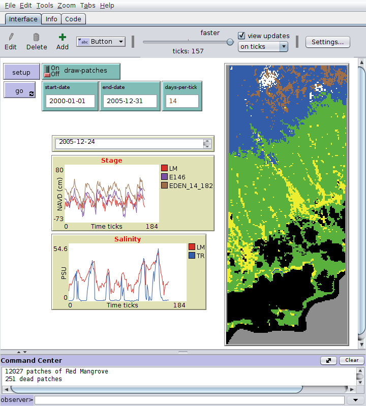

# Ecotone
[NetLogo](https://ccl.northwestern.edu/netlogo/) Ecotone Dynamics Model

## WHAT IS IT?
A [NetLogo](https://ccl.northwestern.edu/netlogo/) dynamic ecotone transformation model. Patches correspond to the 50 x 50 m vegetation classification map developed by Ruiz et al. (2017).  Turtles represent vegetation species.  [Read a whitepaper](./doc/Coastal_Ecotone_ABM_v0.pdf "Ecotone  model description") describing the model, [view slides](./doc/FIU_MOI_EcotoneABM_2018-1-19.pdf "Ecotone & MOI") presenting the development goals. 



## HOW IT WORKS
The Ruiz et al. (2017) vegetation map specifying vegetation codes for each patch has been transformed into a species-centric vegetation map with species binomem explicity identified on each patch. Turtles are initially sprouted on patches according to the GIS vegetation map. 

Environmental data are informed through the time extension, with daily mean water levels and salinities provided as timeseries input to patch agents.  The link between timeseries and patches is specified in a the Gauge_zones.shp GIS layer.

Agentsets of patches with dominant species are used to track and optimally operate agent actions.

## HOW TO USE IT
Setup button initializes the model.

Run button executes the model. 

## NETLOGO FEATURES
Netlogo time extension is used for environmental data input.
Netlog gis extension is used to initialze the patches and turtles. 

## REFERENCES
Ruiz et al., (2017) The Everglades National Park and Big Cypres National Preserve Vegetation Mapping Project, Interim Report–Southeast Saline Everglades (Region 2). Everglades National Park Natural Resource Report NPS/SFCN/NRR—2017/1494. Pablo L. Ruiz, Helena C. Giannini, Michelle C. Prats, Craig P. Perry, Michael A. Foguer, Alejandro Arteaga Garcia, Robert B. Shamblin, Kevin R. T. Whelan, Mary-Joe Hernandez, August 2017.

### Domain
The world is a grid of (118, 273) patches corresponding to a spatial domain of 5,900 x 13,650 m in 50 m patches. The domain wraps hoizontally, but not vertically. The origin is (0,0) in the lower left corner.

Patch elevations are NAVD88 (cm).  Water elevation data from EDEN are NAVD88 (cm).  Water elevation data from hydrographic stations have been previously converted from NGVD29 (ft) to NAVD88 (cm).

### GIS Input
The GIS Shapefile DB initial values are all set into patch variables, ones that are turtle specific (species, binomen, abundance, height...) are transfered to turtle variables in sprout-turtles-on-patches.

Mapping of Species to Veg_Code is in SpeciesFilled.csv

VegMap Shapefile DB fields:
```
------------------------------------
Vegetation  515
Cell_ID     1265362
Veg_Code    MFGcSD
Species     Sawgrass
Binomen     Cladium jamaicense
Abundance   70
MinAbundan  50
MaxAbundan  100
MaxHeight   2
CoHabit     NA
Matrix      NA
Descriptio  Short Sawgrass Marsh-Dense
PolyArea    200.00
NGVD29_Ft   1.298
NAVD88_Ft   -0.2081 <- Loaded to patch elevation in load-gis-shapefile
------------------------------------
```

Stage and Salinity data sources for each patch are specified in Gauge_zones.shp with the Salinity_G and Stage DB fields. Data are read from the corresponding column in the data .csv file.

Gauge Zone Shapefile DB fields:
```
------------------------------------
Salinity_G LM
Stage      Cell_5_183
Zone       EDEN
------------------------------------
```

### Environmental Data
Stage data [DailyStage_NAVD_cm_1994-6-1_2017-5-15.csv] are extracted from EDEN cells if they overlap with the model domain, or, are extracted from Data4EVER hydro stations and converted to NAVD88 (cm). EDEN water surfaces are elevation in centimeters NAVD88.

Salinity data [DailySalinityFilled_1994-6-1_2017-5-15.csv] are from hydrographic stations within Everglades National Park.
