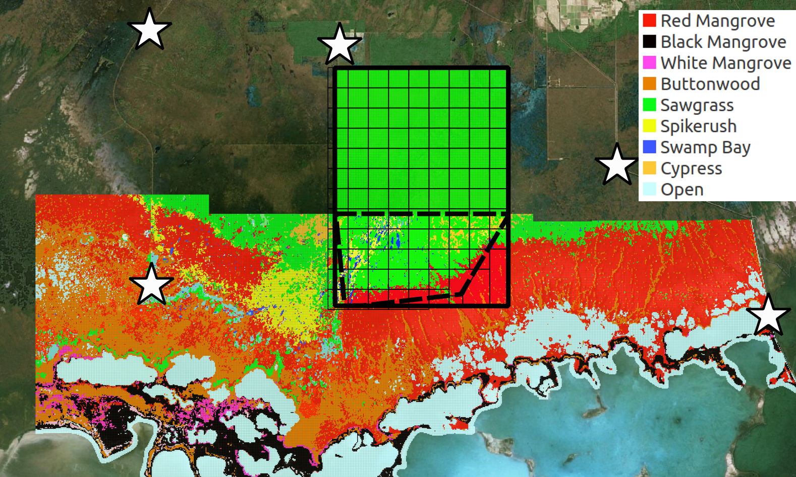
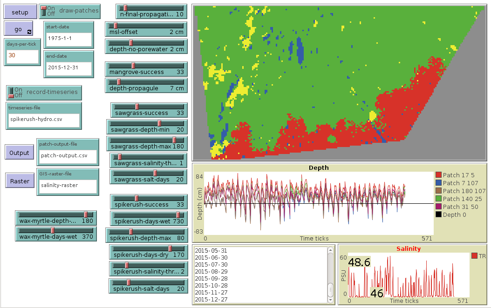
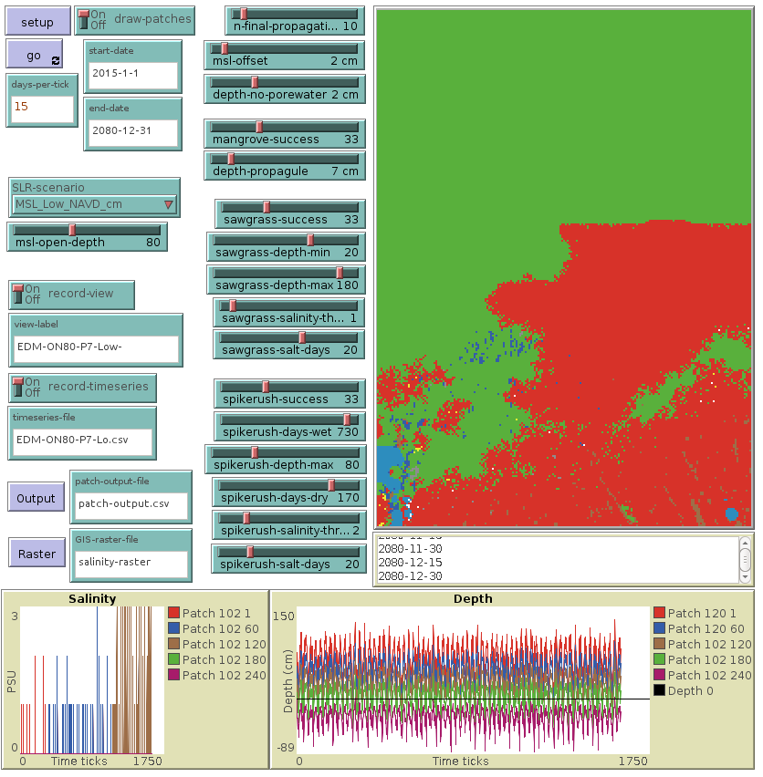

## Ecotone Dynamics Agent Based Models 
Three [NetLogo](https://ccl.northwestern.edu/netlogo/) Ecotone Dynamics Models.

These models characterize observed and future freshwater coastal marsh to saltwater mangrove estuary ecotone dynamics in response to rising sea levels.  [It is suggested](doc/Ecological_Modelling_Submission.pdf) that quantifying landscape vegetation changes from fresh to salt tolerant species informs the underlying fresh to saltwater transformation in the surficial aquifer.

### Model Domain
The model domain covers the southern tip of the Florida Peninsula within Everglades National Park. 

Southern coastal Everglades false color vegetation map. Dashed polygon shows the calibration model domain, rectangle, the future projection domain. The grid defines cells where distinct hydrologic timeseries are applied.

Model|Description
-----|-----------
[Calibration](Calibration_R2_1973) | Freshwater marsh to mangrove calibration model 1973 - 2015
[Future](Future_EDM_1973) | Freshwater to mangrove prediction model 2015 - 2100
[Demo](DemoModel) | Original conceptual model

